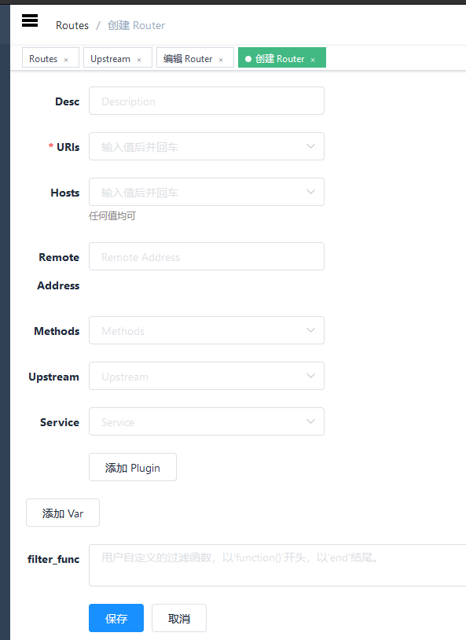
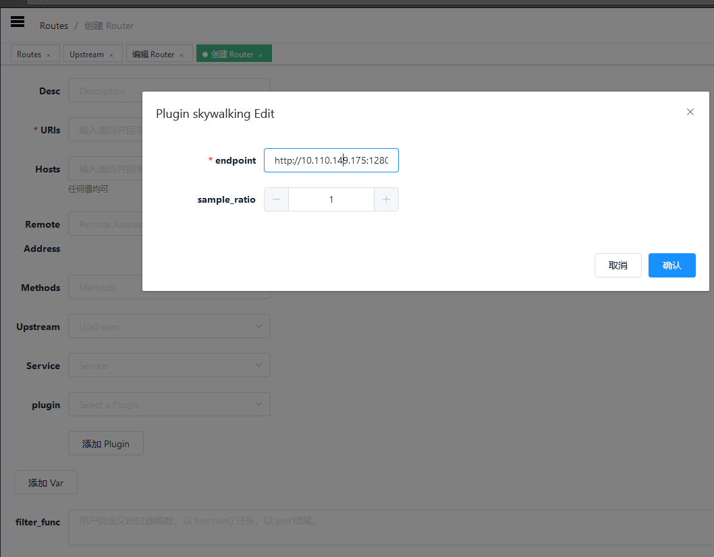

<!--
#
# Licensed to the Apache Software Foundation (ASF) under one or more
# contributor license agreements.  See the NOTICE file distributed with
# this work for additional information regarding copyright ownership.
# The ASF licenses this file to You under the Apache License, Version 2.0
# (the "License"); you may not use this file except in compliance with
# the License.  You may obtain a copy of the License at
#
#     http://www.apache.org/licenses/LICENSE-2.0
#
# Unless required by applicable law or agreed to in writing, software
# distributed under the License is distributed on an "AS IS" BASIS,
# WITHOUT WARRANTIES OR CONDITIONS OF ANY KIND, either express or implied.
# See the License for the specific language governing permissions and
# limitations under the License.
#
-->

[Chinese](../zh-cn/plugins/skywalking.md)

# Summary
- [**Summary**](#Summary)
  - [**Name**](#Name)
  - [**Attributes**](#Attributes)
  - [**How To Enable**](#How-To-Enable)
  - [**Test Plugin**](#Test-Plugin)
    - [**Run Skywalking Example**](#Run-Skywalking-Example)
  - [**Disable Plugin**](#Disable-Plugin)
  - [**Upstream services(Code With SpringBoot)**](#Upstream-services(Code-With-SpringBoot))

## Name

**Skywalking**(https://github.com/apache/skywalking)  is an OpenTracing plugin.\
The skywalking server can supports both http and grpc protocols . The APISIX client only support http protocols.
## Attributes
|Name          |Requirement  |Description|
|-------|-------|-------|
|endpoint|required| the http endpoint of Skywalking ，for example: http://127.0.0.1:12800|
|sample_ratio|required| the ratio of sample, the minimum is 0.00001, the maximum is 1|
|service_name|optional| service name for skywalking reporter, the default values is **APISIX**|

## How To Enable

Here's an example, enable the skywalking plugin on the specified route:

```shell
curl http://127.0.0.1:9080/apisix/admin/routes/1  -H 'X-API-KEY: edd1c9f034335f136f87ad84b625c8f1' -X PUT -d '
{
    "methods": ["GET"],
    "uris": [
        "/uid/*"
    ],
    "plugins": {
        "skywalking": {
            "endpoint": "http://10.110.149.175:12800",
            "sample_ratio": 1,
            "service_name": "APISIX_SERVER"
        }
    },
    "upstream": {
        "type": "roundrobin",
        "nodes": {
            "10.110.149.175:8089": 1
        }
    }
}'
```
You can open dashboard with a browser:`http://127.0.0.1:9080/apisix/dashboard/`，to complete the above operation through the web interface, first add a route:\
\
Then add skywalking plugin:\

## Test Plugin

### Run-Skywalking-Example

#### e.g.
1. Run Skywalking Server:
    - By default,use H2 storage , start skywalking directly
        ```
        sudo docker run --name skywalking -d -p 1234:1234 -p 11800:11800 -p 12800:12800 --restart always apache/skywalking-oap-server
        ```

    -  Of Course,you can use elasticsearch storage
        1. Firstly, you should install elasticsearch:
            ```
            sudo docker run -d --name elasticsearch -p 9200:9200 -p 9300:9300 --restart always -e "discovery.type=single-node" elasticsearch:6.7.2
            ```
        2. You can install ElasticSearch management page: elasticsearch-hq(Optional)
            ```
            sudo docker run -d --name elastic-hq -p 5000:5000 --restart always elastichq/elasticsearch-hq
            ```
        3. Run skywalking server:
            ```
            sudo docker run --name skywalking -d -p 1234:1234 -p 11800:11800 -p 12800:12800 --restart always --link elasticsearch:elasticsearch -e SW_STORAGE=elasticsearch -e SW_STORAGE_ES_CLUSTER_NODES=elasticsearch:9200 apache/skywalking-oap-server
            ```
2. Skywalking WebUI:
    1. Run SkyWalking webUI Server:
        ```
        sudo docker run --name skywalking-ui -d -p 8080:8080 --link skywalking:skywalking -e SW_OAP_ADDRESS=skywalking:12800 --restart always apache/skywalking-ui
        ```
    2. Open the webUI of  skywalking:
        You can open dashboard with a browser: http://10.110.149.175:8080 .it will be a successful install as follow:
        

3. Test:
    -  Access to upstream services through access apisix:
        ```bash
        $ curl -v http://10.110.149.192:9080/uid/12
        HTTP/1.1 200 OK
        OK
        ...
        ```
    - Open the webUI of skyWalking:
        ```
        http://10.110.149.175:8080/
        ```
        You can see the topology of all service\
        \
        You can also see the tracer of all service\
        

## Disable Plugin

When you want to disable the skyWalking plugin, it is very simple,
 you can delete the corresponding json configuration in the plugin configuration,
  no need to restart the service, it will take effect immediately:

```shell
$ curl http://127.0.0.1:2379/v2/keys/apisix/routes/1  -H 'X-API-KEY: edd1c9f034335f136f87ad84b625c8f1' -X PUT -d value='
{
    "methods": ["GET"],
    "uris": [
        "/uid/*"
    ],
    "plugins": {
    },
    "upstream": {
        "type": "roundrobin",
        "nodes": {
            "10.110.149.175:8089": 1
        }
    }
}'
```

The skywalking plugin has been disabled now. It works for other plugins.


## Upstream services(Code With SpringBoot)

```java
package com.lenovo.ai.controller;

import org.springframework.web.bind.annotation.PathVariable;
import org.springframework.web.bind.annotation.RequestMapping;
import org.springframework.web.bind.annotation.RestController;
import javax.servlet.http.HttpServletRequest;

/**
 * @author cyxinda
 * @create 2020-05-29 14:02
 * @desc skywalking test controller
 **/
@RestController
public class TestController {
    @RequestMapping("/uid/{count}")
    public String getUidList(@PathVariable("count") String countStr, HttpServletRequest request) {
        System.out.println("counter:::::-----"+countStr);
       return "OK";
    }
}
```
Configuring the skywalking agent, when starting the service.
update the file of agent/config/agent.config
```
agent.service_name=yourservername
collector.backend_service=10.110.149.175:11800
```
Run the script:
```
nohup java -javaagent:/root/skywalking/app/agent/skywalking-agent.jar \
-jar /root/skywalking/app/app.jar \
--server.port=8089 \
2>&1 > /root/skywalking/app/logs/nohup.log &
```

